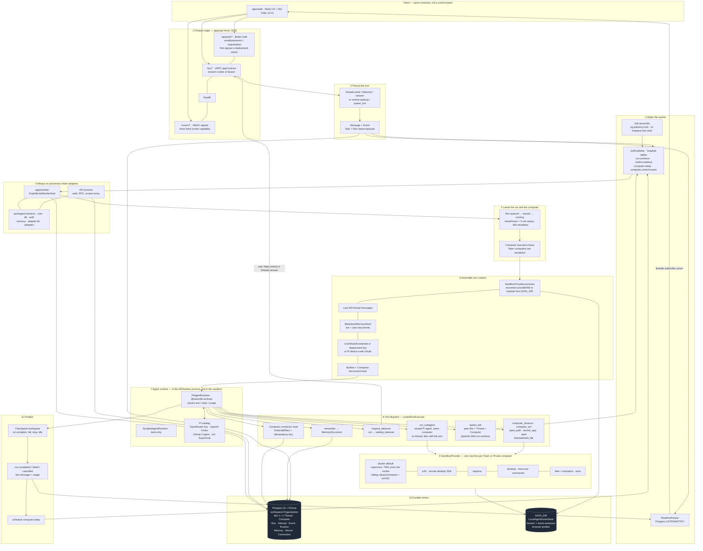

# Architecture

One picture of the product: clients, the always-on API and worker, durable stores, a turn, and the computer / model / plugin backends. The numbered path is how a message (or a routine) becomes work on a bot's computer.

